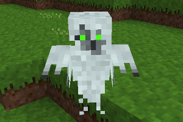

### Mobs Ghost Redo
  
**_Adds ghosts._**

**NOTE:** This is Blockmen's CME Ghost mob ported to Mobs Redo, and tweaked.

**Version:** 0.5.1  
**Source code's license:** GPL v3.0  
**Media (Textures, Models, Sounds) license:** CC-BY-SA 4.0 International.

**Dependencies:** default, bones (found in Minetest Game), mobs (Mobs Redo)  
**Supported:** mobs_humans, mobs_others, moreores  

### Installation

Unzip the archive, rename the folder to mobs_ghost_redo and place it in  
../minetest/mods/

If you only want this to be used in a single world, place it in  
../minetest/worlds/WORLD_NAME/worldmods/

GNU+Linux - If you use a system-wide installation place it in  
~/.minetest/mods/

For further information or help see:  
https://wiki.minetest.net/Help:Installing_Mods